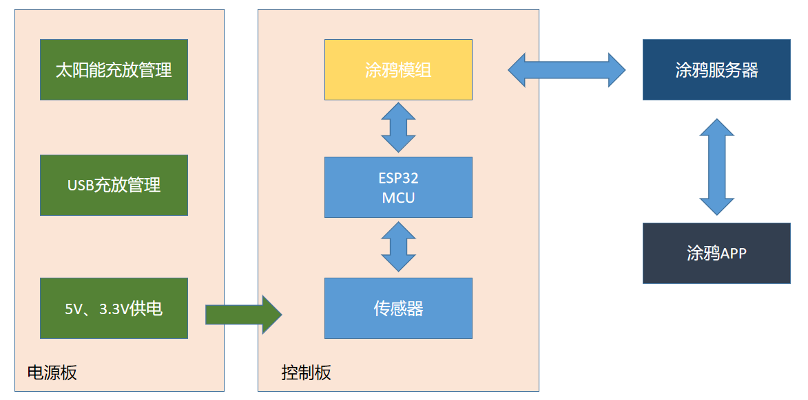
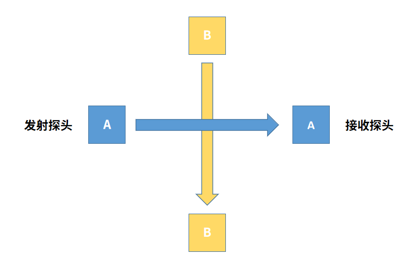
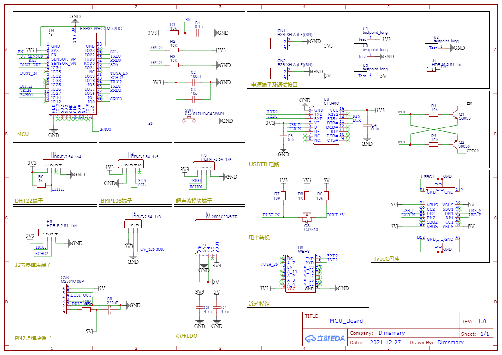
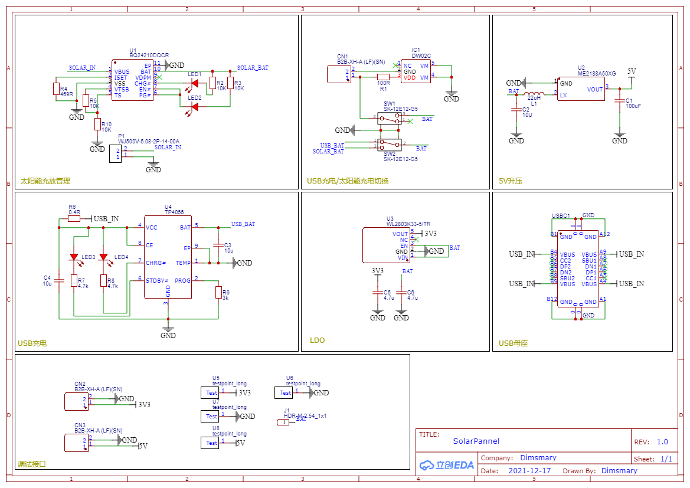
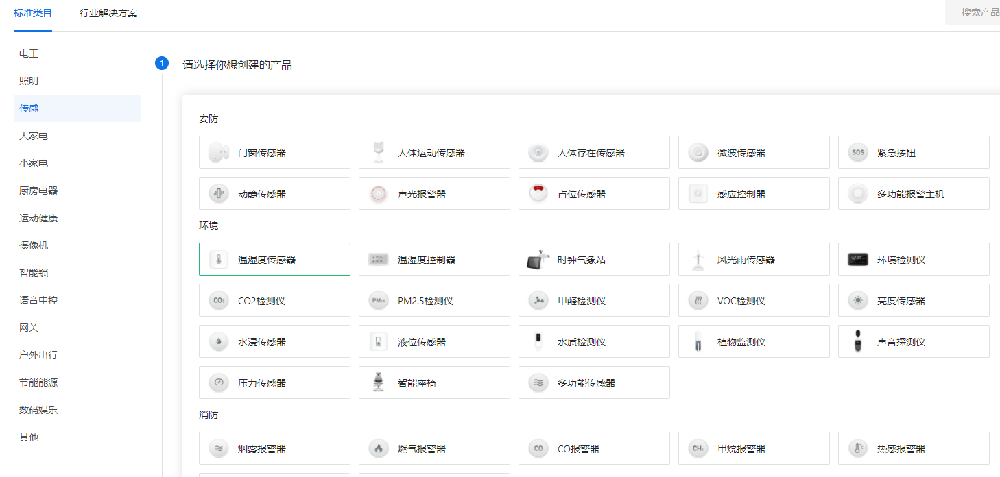
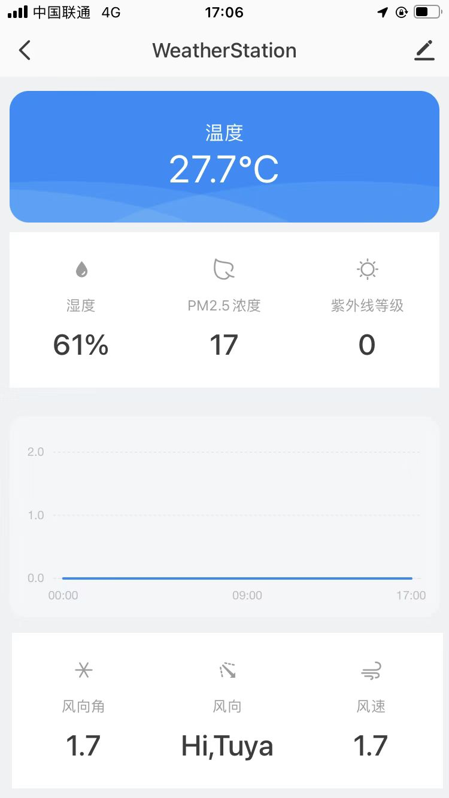
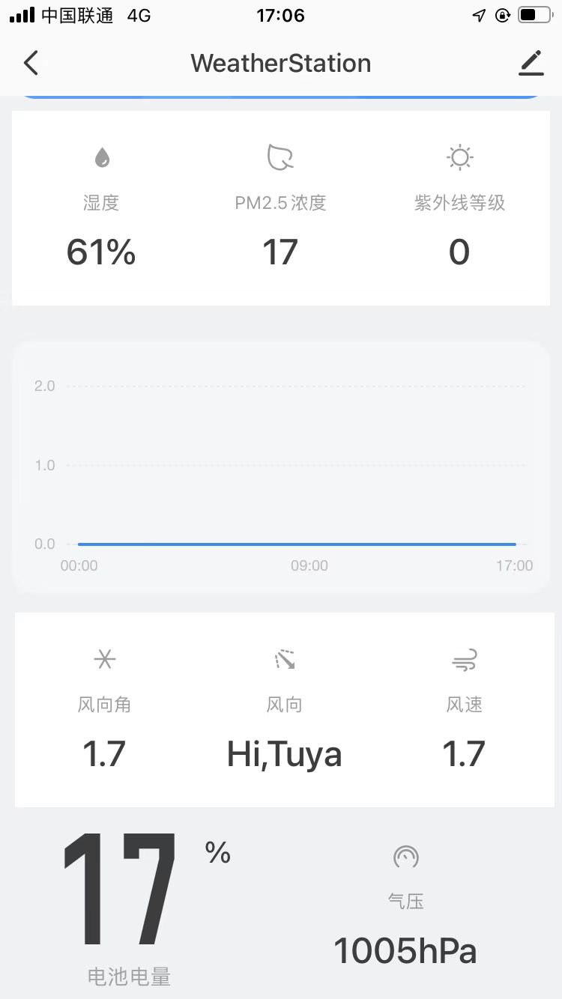
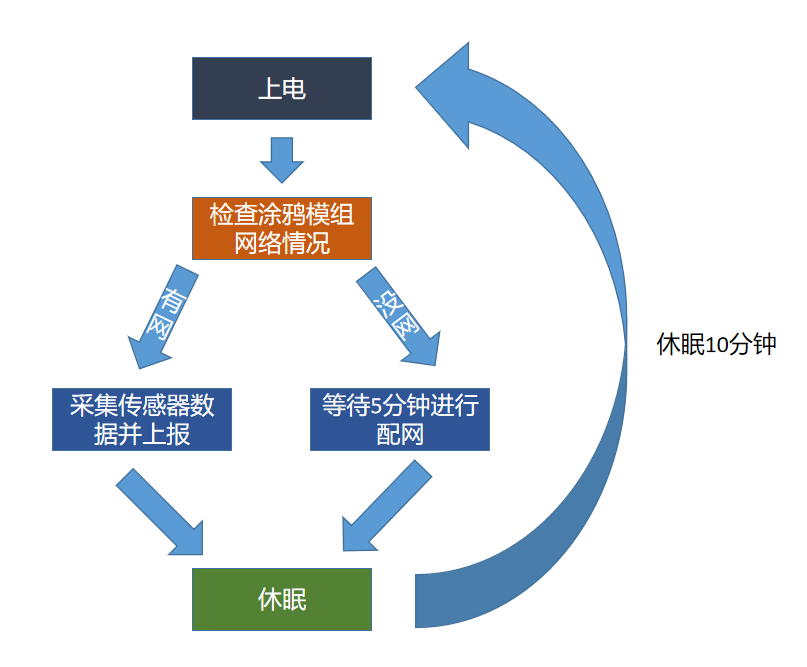

# 超声波气象站搭建指南

嗨，本文将展示如何基于涂鸦智能平台搭建一个属于自己的超声波气象站！

超声波气象站的测量维度包括：

- 温度测量（DHT22）
- 湿度测量（DHT22）
- 气压测量（BMP180）
- 风向、风速测量（防水超声波测距模组）
- 紫外线等级测量（CJMCU-GUVA-S12SD）
- PM2.5测量（GP2Y1014AU）

也就是六个维度的气象信息的测量！

气象站采用**ESP32作为主控**，使用**Arduino平台**进行开发，开发IDE为**Visual Studio Code + Platform IO**。

物联网通讯方面使用涂鸦WBR3模组，使用低代码MCU开发形式。控制界面(APP)使用涂鸦的客制化面板。


Q1: 什么是超声波气象站？

A1: 超声波气象站是利用超声波模组对声速进行测量的一种气象站。由于风速会引起声速的变化：超声波顺风传播时，声速会加快；逆风时风速将减慢；通过测量一组正交的声速矢量，进行合成分析后可以分析出当前的风速、风向信息。

Q2: 超声波气象站有什么优点？

A2: 传统的气象站对于风向和风速的测量通常使用风向仪和风速仪，这两种仪器都具有转动的机械结构，体积庞大、寿命较短。使用超声波对风速、风向测量可以压缩气象站体积、提高气象站寿命。

Q3: 为什么选择涂鸦平台？

A3: 涂鸦平台的开发比较省事。在MCU低代码开发的方式中，可以通过网页实现对APP的设计，而且一些常用的组件也非常精美。


## 系统框架




## 如何利用超声波对风速进行测量



超声波探头布置如图所示，两组探头互相垂直分布。

- 此时若A组探头间**距离S**已知，**声速C**已知，且此时风速为0。则此时超声波的**行进速度T**为声速，可算出**无风时超声波从发射探头移动到接收探头的时间T1**=S/C。

- 若此时存在风向为发射探头指向接收探头，风速为1m/s的风，则超声波行进速度变为C+1m/s，同样可以算出**该情况下超声波从发射探头移动到接收探头的时间T2**=S/(C+1)。

在距离已知、声速已知的情况下，通过获取超声波模块返回的超声波行进时间T2，可以推算出**A组探头方向的风速V1**=(S / T2) - (S / T1)。同理可推算出**B组探头方向的风速V2**。

由于A、B组探头垂直分布，故当存在任意方向、任意大小的风时，可通过矢量合成的方法计算出风速和风向。

## 模块及驱动

**DHT22**

DHT22使用[DHT-Sensor-Library](https://github.com/adafruit/DHT-sensor-library)进行驱动，详细方法参考GitHub页面，使用该库需要依赖[Adafruit Unified Sensor Driver](https://github.com/adafruit/Adafruit_Sensor)库。

```c++
DHT dht(DHT_PIN, DHT_TYPE);
float h = dht.readHumidity();
float t = dht.readTemperature();
    if(isnan(h) || isnan(t)){
        Serial.println("Failed to read from DHT sensor.");
        return;
    }
```

此处h获取值为湿度，t获取值为温度。

**BMP180**

BMP180使用[Adafruit BMP085 Library](https://github.com/adafruit/Adafruit-BMP085-Library)驱动，同上，需要依赖[Adafruit BrushIO](https://github.com/adafruit/Adafruit_BusIO)库。

```c++
Adafruit_BMP085 bmp;
air_pressure = bmp.readPressure()
```

**超声波模组**

```c++
// Clears the trigPin condition
digitalWrite(TRIG_1, LOW);
delayMicroseconds(2);
// Sets the trigPin HIGH (ACTIVE) for 10 microseconds
digitalWrite(TRIG_1, HIGH);
delayMicroseconds(20);
digitalWrite(TRIG_1, LOW);
// Reads the echoPin, returns the sound wave travel time in microseconds
duration = pulseIn(ECHO_1, HIGH);
```

超声波模组使用脉冲测量获取反射时间，代码如上。后续通过布置探头位置，分析两组超声波模组的反射时间可获得风速、风向信息。

**CJMCU-GUVA-S12SD紫外线模组**

该紫外线模组输出为电压模拟量，`analogRead()`函数可以实现紫外线等级的测量。

**GP2Y1014AU PM2.5模组**

```C++
digitalWrite(DUST_IN, LOW);
delayMicroseconds(SAMPLING_TIME);
int voMeasured = analogRead(DUST_OUT);

delayMicroseconds(DELTA_TIME);
digitalWrite(DUST_IN, HIGH);
```

通过给模组的LED驱动脚施加脉冲，测量输出脚电压，可以实现对pm2.5的浓度测量。

**原理图：**



## 太阳能充放电设计



总体充放电系统原理图如图，太阳能充放电采用BQ24210DQCR作为控制。

## 涂鸦智能接入

这次的开发方式为MCU低代码开发，即是利用涂鸦模组进行开发。涂鸦模组负责物联网信息处理，MCU仅需要通过串口控制涂鸦模组进行物联网信息的通讯。

### 创建产品

在进行涂鸦智能的开发时，需要进行产品创建。作为气象站开发，可以选择温湿度传感器。



### DP点创建

在涂鸦智能中，每个气象数据维度可以被抽象为DP（功能点）。在选择了温湿度传感器这个产品后，涂鸦提供了常用的功能点：

| DP ID | 功能点名称 | 标识符             | 数据传输类型 | 数据类型        | 功能点属性                                    |
| ----- | ---------- | ------------------ | ------------ | --------------- | --------------------------------------------- |
| 1     | 温度       | temp_current       | 只上报（ro） | 数值型（Value） | 数值范围: -200-600, 间距: 1, 倍数: 1, 单位: ℃ |
| 2     | 湿度       | humidity_value     | 只上报（ro） | 数值型（Value） | 数值范围: 0-100, 间距: 1, 倍数: 0, 单位: %    |
| 4     | 电池电量   | battery_percentage | 只上报（ro） | 数值型（Value） | 数值范围: 0-100, 间距: 1, 倍数: 0, 单位: %    |

除了这些标准功能中的DP点之外，因为我们还需要风速、风向这些数据，所以还需要添加自定义的DP点：

| DP ID | 功能点名称 | 标识符         | 数据传输类型 | 数据类型         | 功能点属性                                    |
| ----- | ---------- | -------------- | ------------ | ---------------- | --------------------------------------------- |
| 101   | PM2.5浓度  | pm25           | 只上报（ro） | 数值型（Value）  | 数值范围: 0-100, 间距: 1, 倍数: 0, 单位:      |
| 102   | 风向角     | wind_value     | 只上报（ro） | 数值型（Value）  | 数值范围: 0-364, 间距: 1, 倍数: 1, 单位:      |
| 103   | 风向       | wind_direction | 只上报（ro） | 字符型（String） |                                               |
| 104   | 风速       | wind_speed     | 只上报（ro） | 数值型（Value）  | 数值范围: 0-100, 间距: 1, 倍数: 1, 单位:      |
| 105   | 紫外线等级 | uv_level       | 只上报（ro） | 数值型（Value）  | 数值范围: 0-10, 间距: 1, 倍数: 0, 单位:       |
| 106   | 气压       | pressure       | 只上报（ro） | 数值型（Value）  | 数值范围: 0-1999, 间距: 1, 倍数: 0, 单位: hPa |

在功能点中，DP ID为该功能点的标识，MCU在控制涂鸦模组进行数据上传时需要用到。

功能点属性中的倍数为0时，MCU上传的数据被识别为上传的数据本身。若倍数为1，则此时若上传数据为50时，该数据将被涂鸦除以10^1，即50会被识别为5。

### 面板编辑

在产品开发的面板选项卡，可以对自己的APP面板进行自定义。

我使用的面板类型为:面板类型：Studio 面板-个人面板

下面是在手机中的实机效果：





### 硬件开发

在完成了传感器驱动、电源板管理后，需要与涂鸦模组进行通讯，实现信息上报。

在这里我选择的是WBR3 Wi-Fi & Bluetooth 模组。

该模组在初次上电时，可以打开智能生活APP实现配网和面板加载，在完成了配网之后就可以进行实时开发了。

### Arduino SDK

虽然涂鸦提供了Arduino的SDK，但是在实际操作中发现该SDK仅能在Arduino UNO(ATMEGA 328P)中编译通过，在其他型号的单片机编译中都出现了报错，ESP32也不例外。

通过查阅SDK的源代码，发现在ESP32下的编译主要是Software Serial库的兼容性问题，通过简单修改后可以完成编译，实现基础功能，但格林时间以及实时时钟功能未能实现。

魔改SDK地址：https://github.com/Dimsmary/WeatherStation/tree/main/OutDoor/lib/tuya-wifi-mcu-sdk-arduino-library-master

下面是SDK的实际使用代码：

```C++
// define dp
#define temp_pid    1
#define humi_pid    2
#define battery_pid 4
#define pm25_pid        101
#define wind_angle_pid  102
#define wind_direct_pid 103
#define wind_speed_pid  104
#define uv_level_pid    105
#define pressure_pid    106

// Create TuyaWifi object
TuyaWifi my_device;

// input your device pid here
unsigned char pid[] = {""};
// select mcu version, 1.0.0 as commonly use
unsigned char mcu_ver[] = {"1.0.0"};

// create an array to restore the datapoint 
unsigned char dp_array[][2] = 
{
  {temp_pid, DP_TYPE_VALUE},
  {humi_pid, DP_TYPE_VALUE},
  {battery_pid, DP_TYPE_VALUE},
  {pm25_pid, DP_TYPE_VALUE},
  {wind_angle_pid, DP_TYPE_VALUE},
  {wind_direct_pid, DP_TYPE_STRING},
  {wind_speed_pid, DP_TYPE_VALUE},
  {uv_level_pid, DP_TYPE_VALUE},
  {pressure_pid, DP_TYPE_VALUE},
};

unsigned char dp_process(unsigned char dpid,const unsigned char value[], unsigned short length)
{
  /* all DP only report */
  return TY_SUCCESS;
}

void dp_update_all(void)
{
  
}

void setup(){
    ...
    my_device.init(pid, mcu_ver);
  	my_device.set_dp_cmd_total(dp_array, 9);
    // register call back function
  	my_device.dp_process_func_register(dp_process);
  	my_device.dp_update_all_func_register(dp_update_all);
}

void loop() {
    // SDK handle
	my_device.uart_service();
    // Check the wifi connection
  	if ((my_device.mcu_get_wifi_work_state() == WIFI_CONNECTED) || (my_device.mcu_get_wifi_work_state() == WIFI_CONN_CLOUD)) {
    update_sensor();
        // report all the data
        my_device.mcu_dp_update(temp_pid, temp, 1);
        my_device.mcu_dp_update(humi_pid, humi, 1);
        my_device.mcu_dp_update(battery_pid, battery_level, 1);
        my_device.mcu_dp_update(pm25_pid, pm25, 1);
        my_device.mcu_dp_update(wind_angle_pid, wind_angle, 1);
        my_device.mcu_dp_update(wind_speed_pid, wind_speed, (sizeof(dp_string_value) / sizeof(dp_string_value[0])));
        my_device.mcu_dp_update(wind_speed_pid, wind_speed, 1);
        my_device.mcu_dp_update(uv_level_pid, uv_index, 1);
        my_device.mcu_dp_update(pressure_pid, air_pressure, 1);
  }
  ...
```

##  MCU工作流程

